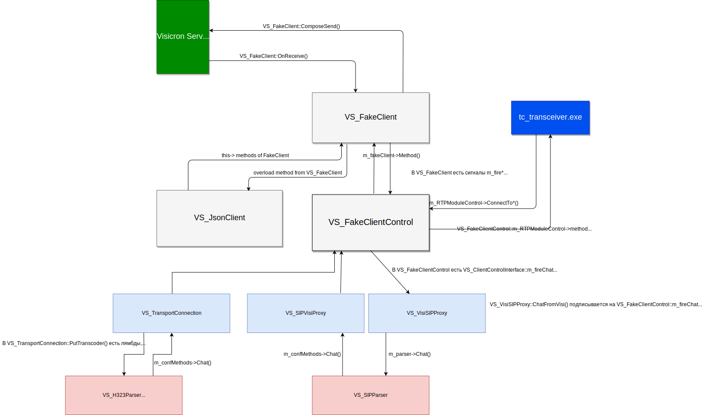

Схема взаимодействия FakeClient с парсерами, трансвером, visicron 
 
<i>Оригинал схемы можно редактировать онлайн тут: https://www.draw.io/#G1GSR7Dv7TZ85uZvnFNFp_MGzG2qHqgZhL</i>

В кратце, на примере чат visi2h323 стек вызова такой:
<pre>
VS_H323Parser::Chat()
VS_TransportConnection::PutTranscoder::__l2::<lambda>
VS_FakeClientControl::onChat(...)
VS_FakeClientInterface::onChat(...)
VS_FakeClient::_onChat(VS_Container& cnt)
VS_FakeClient::OnReceive(const transport::Message& msg)
VS_FakeEndpointV1::Connection::onReceive(const void * data, unsigned int size)
VS_BufferedConnectionBase::ProcessReadBuffer()
VS_BufferedConnectionBase::Handle(const unsigned long trans=276, const VS_Overlapped * ov=0x0548bfa8) Line 233	C++	Symbols loaded.
VS_WorkThreadIOCP::Handle(...)
</pre>
